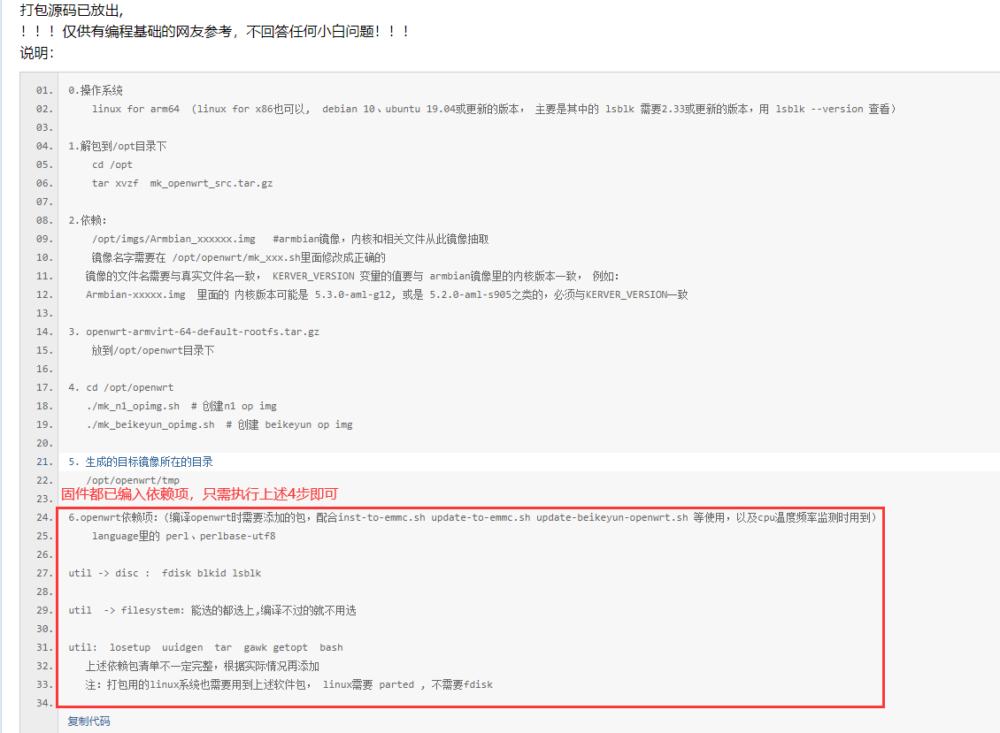

* 北京时间00:00定时编译  
- 密码：password
- X86：192.168.2.1
- K2P：192.168.123.1
- N1： 192.168.123.2
- N1刷入emmc的相关依赖已编入，只需使用flippy大神(https://www.right.com.cn/forum/forum.php?mod=viewthread&tid=981406)的打包脚本即可制作镜像。
- F大的网盘链接：https://pan.baidu.com/s/1BIjHHfi90Oa7Le91Q8gkOg(https://pan.baidu.com/s/1BIjHHfi90Oa7Le91Q8gkOg)
提取码：02im

